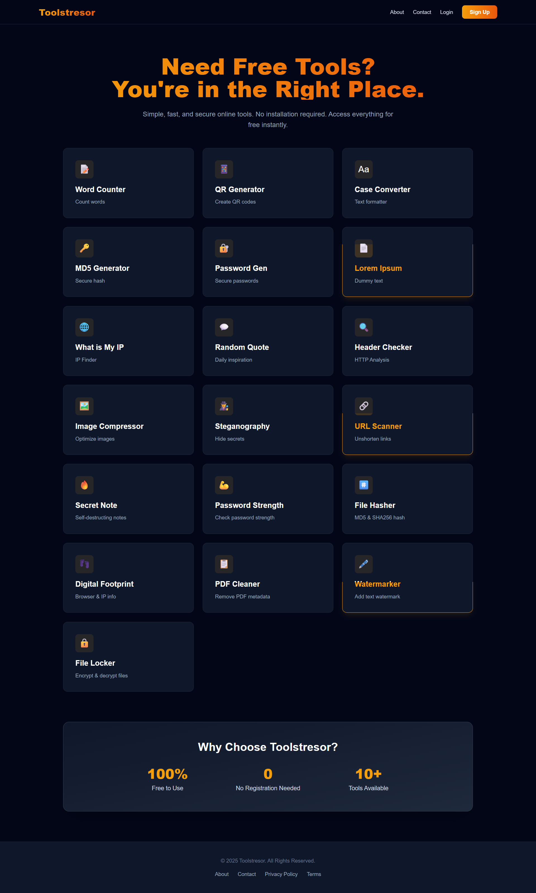
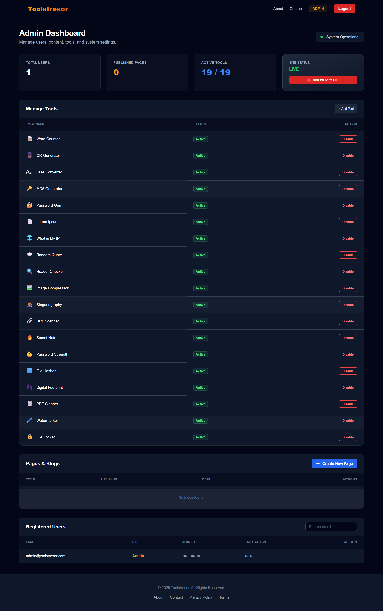

# ToolsTresor


> A free online toolkit with **19+ privacy & utility tools** — no installation required, runs entirely in your browser.

---

## Preview



---

## Tools

| Tool | Description |
|---|---|
| Word Counter | Count words, characters, sentences & paragraphs |
| QR Generator | Generate QR codes from any text or URL |
| Case Converter | UPPER, lower, Title, Sentence case converter |
| MD5 Generator | Generate MD5 hash of any text |
| Password Generator | Secure random password generator |
| Lorem Ipsum | Generate dummy placeholder text |
| What is My IP | Find your public IP address |
| Random Quote | Get a random inspirational quote |
| Header Checker | Inspect HTTP response headers of any URL |
| Image Compressor | Compress images to reduce file size |
| Steganography | Hide or extract secret messages inside images |
| EXIF Cleaner | Strip metadata from images before sharing |
| URL Scanner | Unshorten and trace redirect chains of URLs |
| Secret Note | Create self-destructing one-time read notes |
| Password Strength | Check how strong your password is |
| File Hasher | Get MD5 & SHA256 hash of any file |
| Digital Footprint | See what your browser reveals about you |
| PDF Cleaner | Remove hidden metadata from PDF files |
| Image Watermarker | Add custom text watermark to images |
| File Locker | Encrypt and decrypt files with a secure key |

---

## Admin Panel



The project includes a built-in admin dashboard accessible at `/admin-login`.

**Admin Features:**
- **Manage Tools** — Enable or disable any tool from the homepage without touching the code
- **Add New Tools** — Register new tool entries directly from the panel
- **Pages & Blog** — Create, view, and delete blog/info pages with custom URL slugs and SEO meta tags
- **User Management** — View all registered users, their join date, last active time, and delete accounts
- **Maintenance Mode** — Toggle the entire website offline instantly with one click (admin access remains active)
- **Live Stats** — See total users, published pages, and active tool count at a glance

> **Note:** This project was built as a college-level learning project. The admin panel and overall system are **not production-hardened**. Features like the admin panel are meant to demonstrate the concept of a CMS-style tool manager. If you plan to deploy this publicly, make sure to change the default admin credentials, use environment variables for secrets, and add proper security layers. Use this as a **reference or starting point**, not a ready-to-deploy product.

---

## How to Run

**1. Clone the repository**
```bash
git clone https://github.com/rajannishad2525/ToolsTresor.git
cd ToolsTresor
```

**2. Install dependencies**
```bash
pip install -r requirements.txt
```

**3. Run the app**
```bash
python app.py
```

**4. Open in browser**
```
http://localhost:5000
```

---

## Admin Access

| Field | Value |
|---|---|
| URL | `/admin-login` |
| Email | `admin@toolstresor.com` |
| Password | `admin123` |

---

## Tech Stack

- **Backend** — Python, Flask, SQLAlchemy, SQLite
- **Frontend** — HTML, Tailwind CSS, JavaScript
- **Libraries** — Pillow, Stegano, Cryptography, pypdf, qrcode

---

## Team

Built as a college project by:

- **Rajan Nishad**
- **Rahul Kumar**
- **Raj Karan**

---

## License

MIT License — free to use, modify and distribute.
